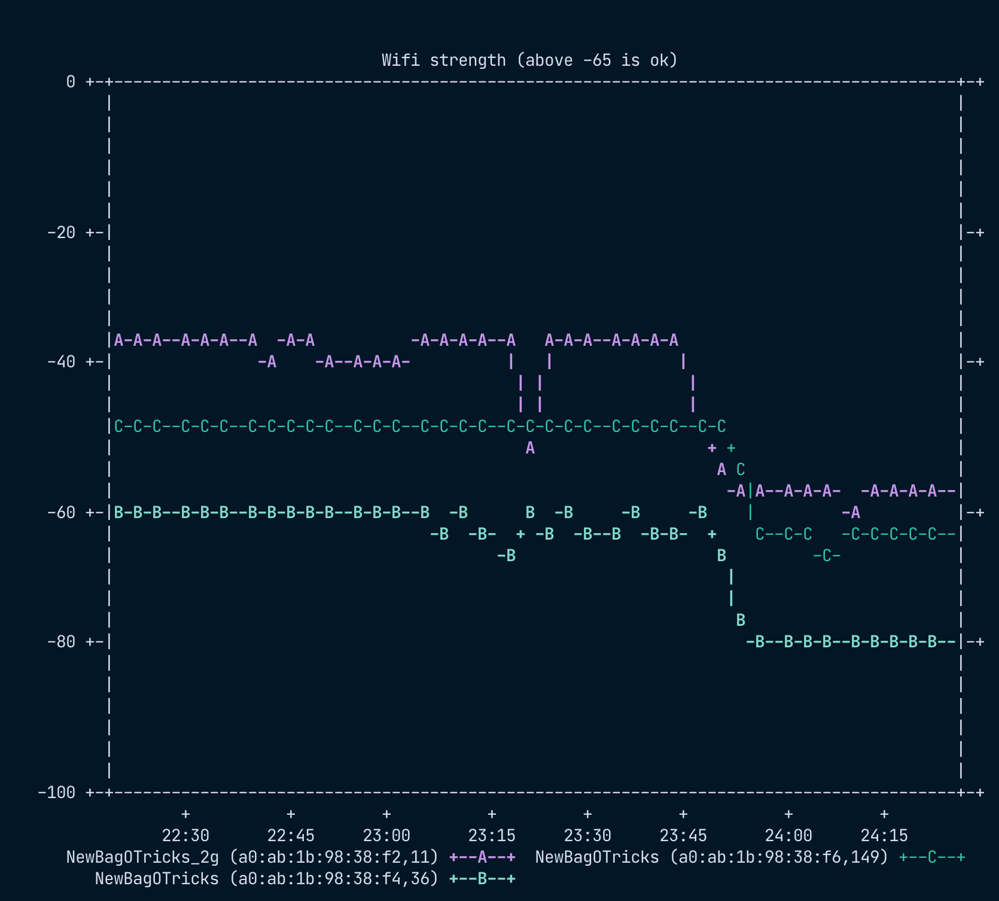

OSX WIFI Scanning
=================

A collection of scripts to automate wifi scanning and signal strength capturing.

Installation
------------

This is just a bunch of little `bash` scripts, so aside from that (and common
GNU tools) the main dependencies are:

- `airport` (the OSX scanning utility)
- `feedgnuplot` and `gnuplot` (only required if you want to plot)

Usage
-----

Run a scan (using `airport` to scan):

```sh
$ ./scan
2023-11-19T21:21:39+0800	1700400099	OPTUS_B272	80:20:da:b2:67:e4	132	-83
2023-11-19T21:21:39+0800	1700400099	Padock wifi	d0:db:b7:99:51:74	11	-85
2023-11-19T21:21:39+0800	1700400099	WiFi-3A11	d8:47:32:68:3a:11	9	-90
2023-11-19T21:21:39+0800	1700400099	WiFi-863375	b0:a7:b9:86:33:75	7	-93
2023-11-19T21:21:39+0800	1700400099	WiFi-85F7	b0:95:75:56:85:f7	8	-86
2023-11-19T21:21:39+0800	1700400099	Vodafone-5	e8:48:b8:91:fd:6a	1	-90
2023-11-19T21:21:39+0800	1700400099	Tineco_0250	3e:61:5:d8:61:9d	1	-83
```

Scan only specific networks:

```sh
$ ./scan "Network1" "Network2"
2023-11-19T21:16:42+0800	1700399802	Network1	a0:a0:a0:a0:a0:01	11	-36
2023-11-19T21:16:42+0800	1700399802	Network2	a0:a0:a0:a0:a0:11	36	-61
2023-11-19T21:16:42+0800	1700399802	Network2	a0:a0:a0:a0:a0:12	149	-47
```

Repeatedly scan specific networks:

```sh
$ ./monitor "Network1" "Network2"
2023-11-19T21:16:42+0800	1700399802	Network1	a0:a0:a0:a0:a0:01	11	-36
2023-11-19T21:16:42+0800	1700399802	Network2	a0:a0:a0:a0:a0:11	36	-61
2023-11-19T21:16:42+0800	1700399802	Network2	a0:a0:a0:a0:a0:12	149	-47
2023-11-19T21:16:45+0800	1700399805	Network1	a0:a0:a0:a0:a0:01	11	-37
2023-11-19T21:16:45+0800	1700399805	Network2	a0:a0:a0:a0:a0:11	36	-61
2023-11-19T21:16:45+0800	1700399805	Network2	a0:a0:a0:a0:a0:12	149	-46
# Ctrl+C
```

Repeatedly scan, plotting in the terminal:

```sh
$ ./monitor "Network1" | ./plot --terminal "dumb ansi $COLUMNS,$((LINES-4))"
```

